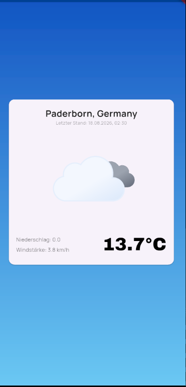

# Weather App

A Flutter app that shows the current weather for wherever you are. It reads the device's GPS position, resolves it to a place name, and fetches live conditions from the Open-Meteo API — no setup, no API key, no manual location entry.

Built as a practice project while learning Flutter, with the goal of chaining three independent sources — device sensors, a geocoding service and a REST API — into one screen.

## Features

- Detects the current position via GPS on app start
- Resolves coordinates to a readable place name through reverse geocoding
- Shows temperature, precipitation, wind speed and an animated weather icon matching the current conditions
- Switches between day and night icons based on the API's `is_day` flag
- Displays the timestamp of the last reading in German locale format
- Explicit error screens for disabled location services, denied permissions and network problems — each with a retry button, so granting a permission does not require restarting the app
- Loading indicator while position and weather data are being fetched
- Responsive layout — the weather card and all font sizes scale with the available screen space

## Screenshots



## How it works

The weather is resolved in three steps, wrapped in a single `Future` that the UI consumes through a `FutureBuilder`. The future is created once in `initState` and only replaced when the user hits retry, so a rebuild never triggers a second request.

1. **Location** — `geolocator` checks whether location services are enabled and whether the app holds permission, requests it if needed, and rejects the permanently-denied case with its own message. Then it reads the current position at high accuracy.
2. **Place name** — the coordinates are passed to `geocoding`, which returns city and country for display. If that lookup fails, the app falls back to a placeholder instead of breaking the screen.
3. **Weather** — coordinates go to the Open-Meteo REST API over `http`; the JSON response is mapped onto a `Weather` model.

Every failure along the way — services off, permission denied, permission denied forever, no connection, non-2xx response, unreadable payload — throws a message written for the user rather than a stack trace. The UI shows that message and offers a retry.

```
lib/
├── Model/     Weather (JSON mapping, reverse geocoding)
├── Service/   WeatherService (permissions, position, API call)
└── main.dart  UI: gradient background, weather card, loading and error states
```

## Tech

Flutter · Dart · [Open-Meteo API](https://open-meteo.com/) · [geolocator](https://pub.dev/packages/geolocator) · [geocoding](https://pub.dev/packages/geocoding) · [http](https://pub.dev/packages/http) · [google_fonts](https://pub.dev/packages/google_fonts) · [weather_icons_animated](https://pub.dev/packages/weather_icons_animated)

## Getting started

```bash
git clone https://github.com/KPfanne/flutter-weather-app.git
cd flutter-weather-app
flutter pub get
flutter run
```

No API key required — Open-Meteo is free to use without registration.

Location services must be enabled on the device, and the app asks for location permission on first launch. On an emulator, set a mock location beforehand, otherwise no position can be resolved.
